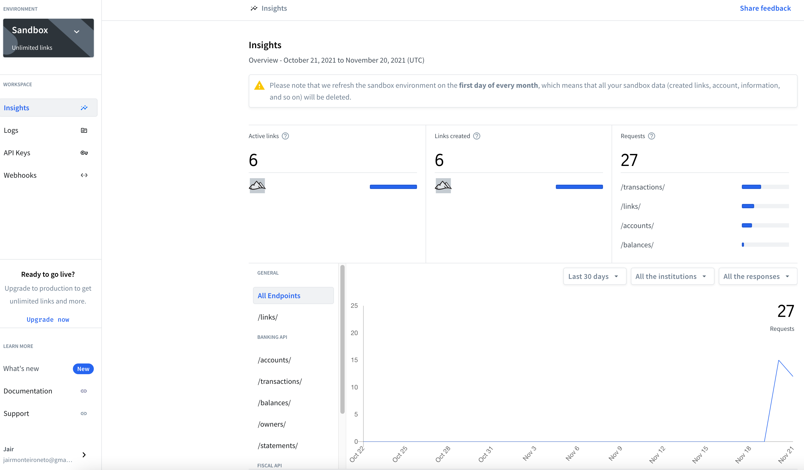
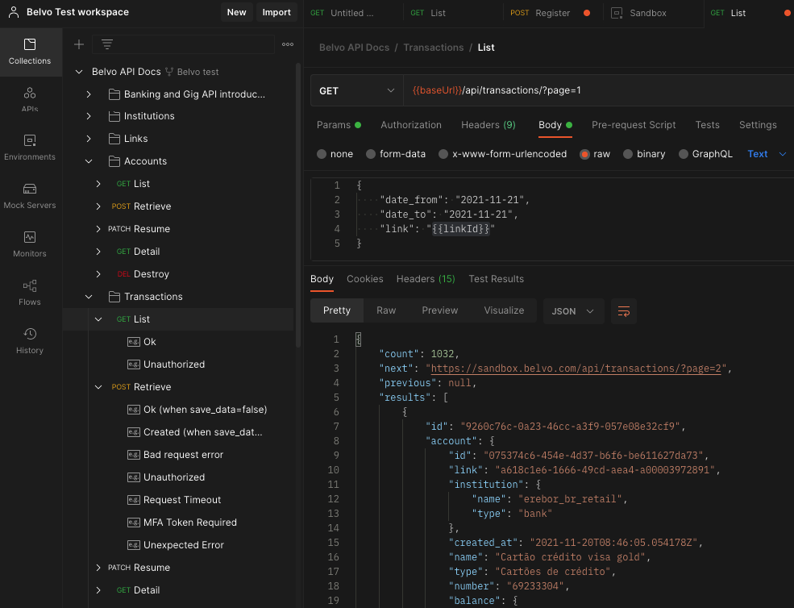
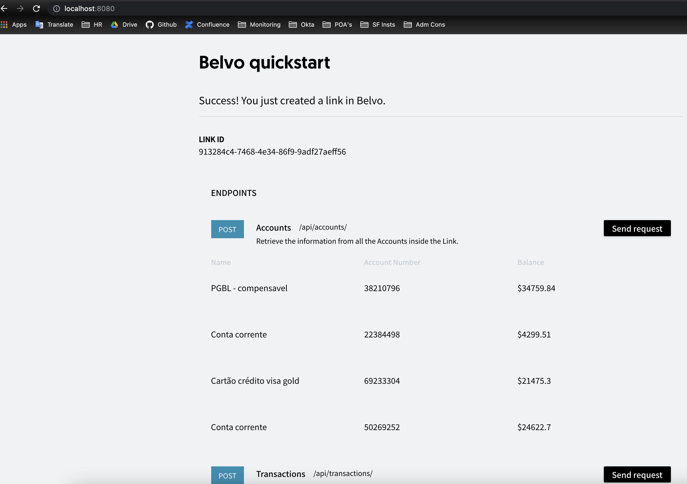

# Belvo API Integration test

`The main goal of this challenge was get familiar with Belvo’s API and build a product using it with the sandbox environment.`

  
  
  

### In this project I could have a overview about the Belvo's API and the solution the company is providing to help the market's evolution through the open bank eco system.

## Topics:

- [x] Accounts
- [x] Transactions
- [x] Balance
- [x] Incomes

### Response Codes

- 200 ✅ Success - The content is available in the response body.
- 201 ✅ Success - The content was created successfully on Belvo.
- 204 ✅ Success - No content to return.
- 400 ❌ Bad Request Error - Request returned an error, detail in content.
- 401 ❌ Unauthorized - The Belvo credentials provided are not valid.
- 404 ❌ Not Found - The resource you try to access cannot be found.
- 405 ❌ Method Not Allowed - The HTTP method you are using is not accepted for this resource.
- 408 ❌ Request Timeout - The request timed out and was terminated by the server.
- 428 ❌ MFA Token Required - MFA token was required by the institution to connect.
- 500 ❌ Internal Server Error - The detail of the error is available in the response body.

<footer>
      <small>© 2021 Jair Neto. All rights reserved.
                          
  

  
  
  
  
  
  

